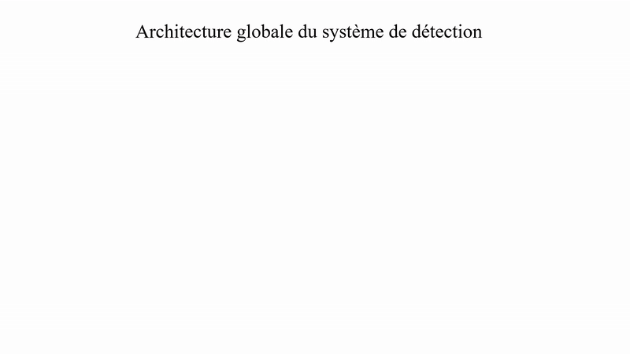
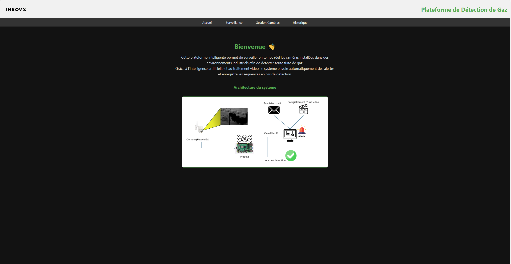
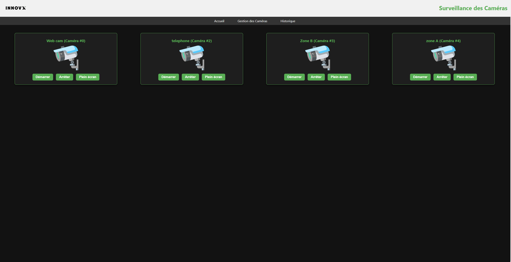
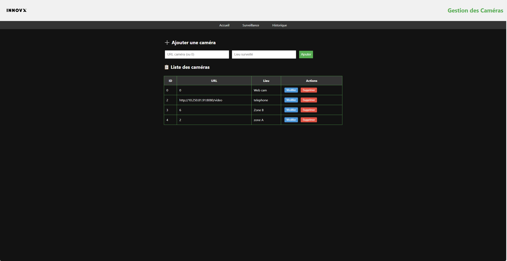
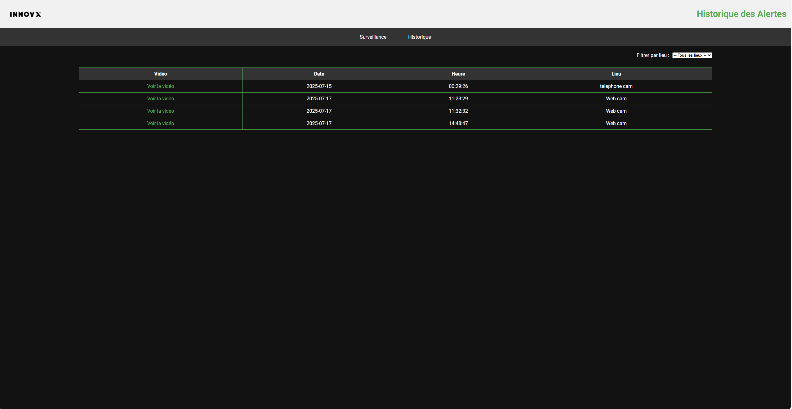
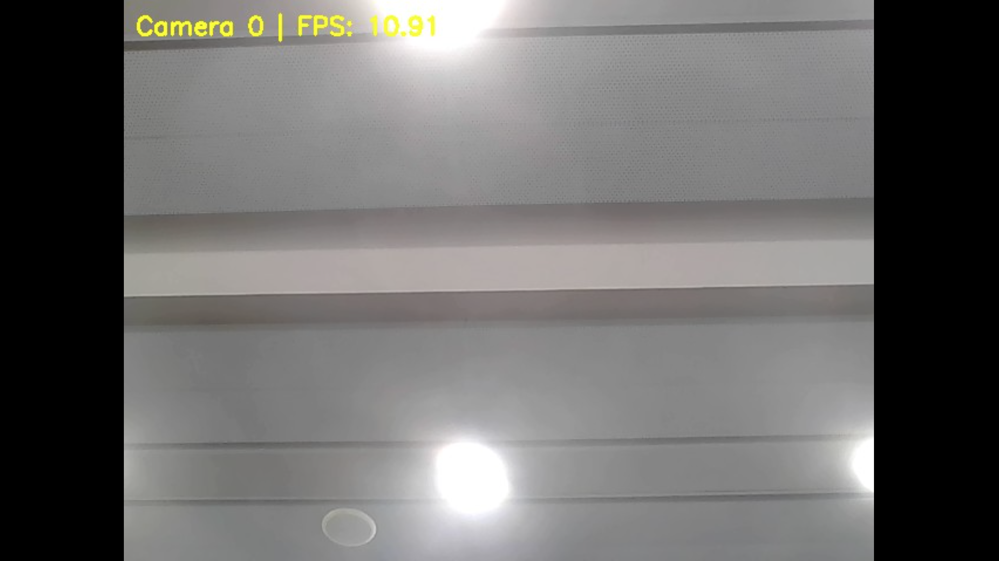
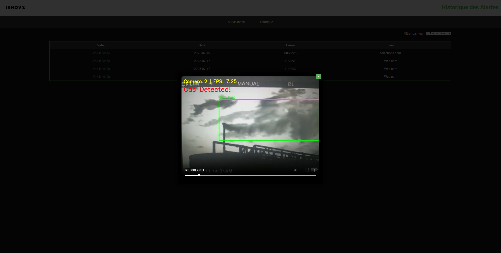

# Gas-leak-detection-app


Application enabling real-time automatic detection of gas leaks using computer vision. It provides audible and visual alerts, along with a dashboard for monitoring, to enhance safety in industrial environments.
# ⚡ Gas Leak Detection Web Application (FastAPI Deployment)

## 🧠 System Architecture

This option deploys a web application based on **FastAPI** for real-time gas leak detection using computer vision.

---

## ⚙️ Web Application Features

- Monitor multiple IP or USB cameras in real-time.
- Automatically detect gas leaks using a YOLO (ONNX) model.
- Automatically record a 20-second video (10s before + 10s after detection).
- Send email alerts.
- Trigger a local alarm.
- Interactive web dashboard to view live camera feeds.
- View detection history in a filterable table.
- Filter events by location.

---

## 🖥️ System Requirements

| Software | Minimum Version | Notes |
|----------|----------------|-------|
| Python   | 3.9+           | Recommended: 3.10 or 3.11 |
| pip      | ≥ 21.0         | `python -m pip install --upgrade pip` |
| OpenCV   | 4.5+           | `pip install opencv-python` |
| ONNX Runtime | 1.15+       | `pip install onnxruntime` |
| ffmpeg   | 4.4+           | Required for H.264 encoding: `apt install ffmpeg` or `brew install ffmpeg` |
| OS       | Linux / macOS / Windows | Tested on Ubuntu 22.04 & Windows 11 |

---

## 📦 Python Dependencies

Install required packages:

```bash
pip install -r requirements.txt
```
Built-in Python libraries used (no installation needed):

os, json, time, base64, threading, collections, asyncio, datetime, queue, smtplib, email.message, subprocess

📧 Email Alert on Gas Detection

When gas is detected, an email alert is automatically sent.

Example (inside send_alert_email function):
```bash
with smtplib.SMTP_SSL('smtp.gmail.com', 465) as smtp:
    smtp.login('meilleurtechnologie@gmail.com', 'YOUR_APP_PASSWORD')
    smtp.send_message(msg)
```
⚠️ Important Notes:

Replace the email address and password with your own credentials.

Use a Gmail App Password (not your personal password).

It is strongly recommended to use environment variables to hide sensitive info.

Never commit credentials to a public GitHub repository.

Complete Email Alert Function:
```bash
from email.message import EmailMessage
import smtplib

def send_alert_email(timestamp):
    msg = EmailMessage()
    
    # ⚠️ Modify these lines
    msg['Subject'] = '🛑 Gas Alert Detected'
    msg['From'] = 'YOUR_EMAIL@gmail.com'
    msg['To'] = 'RECIPIENT_EMAIL@example.com'
    
    msg.set_content(f"""
    ⚠️ Gas detection recorded!

    Details:
    - Date & Time: {timestamp}

    Please check the video recording.
    """)
    
    try:
        with smtplib.SMTP_SSL('smtp.gmail.com', 465) as smtp:
            smtp.login('YOUR_EMAIL@gmail.com', 'YOUR_APP_PASSWORD')
            smtp.send_message(msg)
            print("✅ Alert email sent successfully.")
    except Exception as e:
        print("❌ Error sending alert email:", e)
```
🖥️ Application Interfaces
## 🖥️ System Interfaces

### 1️⃣ Welcome Interface
Overview of the gas detection system.

Explains how the system works and displays system architecture.




---

### 2️⃣ Camera Monitoring Interface

Displays live feeds for each camera.

Shows FPS for each feed.

Provides additional actions (start, stop, fullscreen).




---

### 3️⃣ Camera Management Interface

Add, modify, or remove cameras.

Shows connected cameras with ID, URL, location, and possible actions.




---

### 4️⃣ Alert History Interface

View detection history.

Filter records by location and date.




---

### 5️⃣ Fullscreen Camera View

View a camera in fullscreen mode.




---

### 6️⃣ Video Playback for Historical Alerts

Watch recorded gas detection videos.




---

# 🎥 Demo Videos

## GIF Demonstrations

### Demo 1


### Demo 2


---

## MP4 Video Demonstrations

> GitHub does not play MP4 directly inside Markdown, but you can embed using HTML.

### Demo 1
<video src="demos/demo_1.mp4" controls width="700"></video>

### Demo 2
<video src="demos/demo_2.mp4" controls width="700"></video>

Or clickable links:

- 📹 [Watch Demo 1](demos/demo_1.mp4)
- 📹 [Watch Demo 2](demos/demo_2.mp4)
⚙️ Installation

Clone the project:

git clone https://github.com/EmbeddiaInnovX/ComputerVision_Based_AQS.git

Navigate to the application folder:

cd ComputerVision_Based_AQS/Gas_detection_app_(option 2)/

Install Python dependencies:

pip install -r requirements.txt

Run the FastAPI application:

uvicorn app:app --reload

Access the application in your browser:

http://127.0.0.1:8000

---

If you want, I can also **add badges for Python, FastAPI, ONNX, and build status** to make your README l
